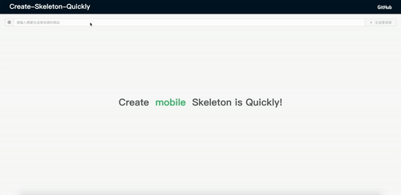

# _create-skeleton-quickly_

- 快速生成网页骨架屏的可视化工具。
- 支持同时生成多个网页的骨架屏代码。
- 提供了便捷的 CLI 命令，安装即用。

### QuickStart

```shell
npm i create-skeleton-quickly -g
```

- 方法一：打开可视化界面

```shell
csq run 5000 //谷歌会自动打开，其他浏览器需要手动
```



- 方法二：配置文件生成骨架屏代码

  1. 生成配置文件

  ```shell
  csq init // 在当前文件夹创建skeleton.config.js
  ```

  2. 开始编译

  ```shell
  csq start // 开始生成骨架屏代码
  ```
  
- 方法三：提供了扩展方法

  ```shell
  const DrawPageStructure = require('create-skeleton-quickly');
  
  new DrawPageStructure({
      isAnimation: true,
      background: '#ecf0f2',
      pages: [
          {
              url: 'https://www.baidu.com',
          },
      ],
  })
      .start()
      .then(res => {
          console.log(res);
      });
  ```

### 关于 skeleton.config.js

|      参数      |          说明          | 参数类型 | 是否必填 | 默认值  |
| :------------: | :--------------------: | :------: | :------: | :-----: |
|  isAnimation   |      是否开启动画      | Boolean  |    否    |  true   |
|   background   |      骨架屏主题色      |  Color   |    否    | #ecf0f2 |
| outputFilePath |      公共输出路径      |  String  |    否    |   无    |
|     device     |        设备类型        |  String  |    是    | mobile  |
|      init      | 生成骨架屏之前函数处理 |   Fuc    |    否    |   Fuc   |
|     custom     |      自定义骨架屏      |   Fuc    |    否    |   Fuc   |
|     pages      |  生成骨架屏页面的配置  |  Array   |    是    |   无    |

#### pages 参数说明

|      参数      |       说明       | 数据类型 | 是否必填 | 默认值 |
| :------------: | :--------------: | :------: | :------: | :----: |
|      url       |     网页地址     |  String  |    是    |   无   |
| outputFileName | 输出的 html 名称 |  String  |    是    |   无   |
| outputFilePath |  输出的路径地址  |  String  |    否    |   无   |

> 如果 pages 的元素没有设置 outputFilePath，会使用公共的输出路径 outputFilePath
